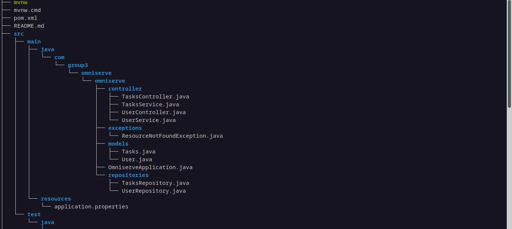
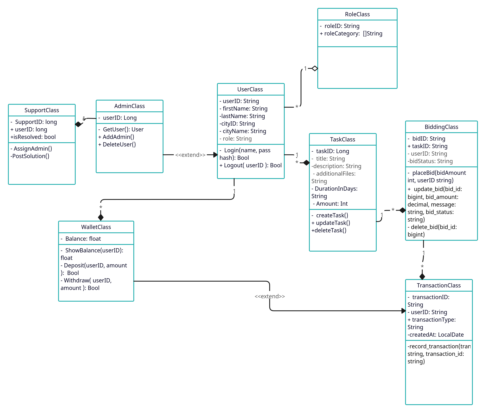

# Omniserve
Group 3 OOP Project  

The dev phase requires java 17, maven for dependency management and a local postgres db. The db has to have an omniserve database as specified in the /resources/application.properties file,  
with the required credentials to the local postgresql instance.

-> All dependencies are help in the POM.xml file in the root directory.  
-> The application is a REST API following the MVC architecture written in spring boot version 3.1.4  
-> If not used to maven and spring boot project file structure please use the `tree` command  
 in unix and unix-like systems or the alt. in Windows and Mac.  
 The file layout should be as show below. Note I have ommited generated classes for brevity.  
   

-> The deliverable is a jar file with functional endpoints that meet the systems specs.  

-> A summary of the classes can be seen below  
  

*Done*
- Project structure  
- USER CRUD    
- Tasks CRUD  
- User and Tasks relationship
- Wallet class
- Wallet and User relationship

*TODO* 
- Transaction functionality  
- Bid functionality  
- User authentication  